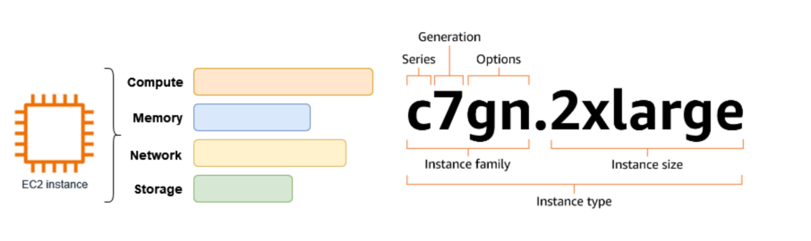

# AWS EC2
- ON-demand, scalable computing service offered by AWS for running your very own VMs.
- Get what you need, when you need it.
- Infrastrcture as a service (IaaS).

## why?
- You only pay for exactly what you use while it's running.
  - you do not get charged for the time it is not running.
- you avoid wasted capacity by using the ability to grow and shrink your infrastructure as needed.
- you can scale up or down based on your needs.

## Basic Concepts
- **Compute** - The amount of virtual CPUs (vCPUs) that your VMs use to run applications.
- **Storage** - Virtual hard drive, temporary or network storage.
  - **EBS** - Elastic Block Store, persistent block storage for your VMs.
  - **Instance Store** - Temporary storage that is physically attached to the host computer.
  - **S3** - Simple Storage Service, object storage for storing and retrieving any amount of data.
  - **EFS** - Elastic File System, a scalable file storage service for use with AWS Cloud services and on-premises resources.
- **Networking** - the connections between your VMs and other resources, such as the internet or other AWS services.
- **Memory** - the RAM that your VMs use to run applications and store data.
- **Key Pairs** - A pair of public and private keys used to securely connect to your VMs.
- **Security Groups** - A set of rules that control inbound and outbound traffic to your VMs.
- **Elastic IPs** - Static IP addresses that can be associated with your VMs.

## EC2 Key pair
- A set of regional security credentials that you use to connect to your EC2 instances.
- Comprised of a public key and a private key.
- The public is stored on the instance, and the private key is stored on your local machine.
  - The private key is used to authenticate your connection to the instance.
  - The public key is used to encrypt the connection.
  - The private key is never shared with AWS or anyone else.
  - The public key is stored in the instance metadata, which is accessible only to the instance itself.
- Use these key paris to:
  - SSH into your instances.
  - Decrypt the administrator password for windows instances (used to RDP).

## AMI (Amazon Machine Image)
- An AMI is a pre-configured virtual machine image that contains the operating system, application server, and applications required to launch an instance.
- AMIs are used to create instances, which are virtual machines that run on the AWS cloud.
- You can create your own AMIs or use pre-built ones from the AWS Marketplace.
- Types of AMIs:
  - **Public AMIs** - Available to all AWS users, often provided by AWS or third-party vendors.
  - **Private AMIs** - Created by you and only accessible within your AWS account.
  - **Shared AMIs** - Shared with specific AWS accounts or made public.
- AMI use cases:
  - Prebaking: Embedding a significant portion of your application artifacts within an AMI so it is loaded at instance launch and ready to go, faster.
  - Create a golden AMI with all the necessary patches updates to deploy monthly.
  - Standardize deployments to ensure each EC2 instance has the exact same installations and custom software configurations.
  
## Instance Types and Sizes
- class and generation: The instance type is named based on the class and generation.
  - **Class**: The type of instance, such as T (burstable), M (general purpose), C (compute optimized), R (memory optimized), I (storage optimized), P (accelerated computing).
  - **Generation**: The version of the instance type, such as 1, 2, 3, etc.
- **Size**: The size of the instance based on compute, memory, and storage resources.
  - Sizes are denoted by a letter, such as nano (n), micro (m), small (s), medium (m), large (l), xlarge (x), 2xlarge (2x), etc.
- **Naming convention**:

### Instance Types
- **General Purpose**: Balanced compute, memory, and networking resources.
  - Examples: T3, M5, M6g
- **Compute Optimized**: High-performance processors for compute-intensive workloads. used for modeling, gaming, batch processing, and high-performance web servers.
  - Examples: C5, C6g
- **Memory Optimized**: High memory-to-CPU ratio for memory-intensive applications. Primaryly used for workloads of processing large datasets in memory. like caching, in-memory databases, and real-time big data analytics.
  - Examples: R5, R6g, X1, X2, z1d
- **Accelerated Computing**: Instances with hardware accelerators, such as GPUs or FPGAs, for specialized workloads. used for machine learning inference and training, graphics rendering, and high-performance computing (HPC).
  - Examples: P3, P4, G4, G5
- **Storage Optimized**: High disk throughput and IOPS for data-intensive workloads. used for workloads that require high disk throughput and IOPS, such as NoSQL databases, data warehousing, and log processing.
  - Examples: I3, D2
- **HPC (High Performance Computing)**: Instances designed for high-performance computing workloads, such as scientific simulations and financial modeling.
  - Examples: Hpc6a, Hpc6id

## Instance Lifecycle
- **Pending**: The instance is being launched.
- **Running**: The instance is running and available for use.
- **Stopping**: The instance is being stopped.
- **Stopped**: The instance is stopped and not running, but the data on the instance store is preserved.
- **Shutting Down**: The instance is being terminated.
- **Terminated**: The instance is terminated and cannot be restarted. The data on the instance store is lost.
- **Rebooting**: The instance is being rebooted, which does not change the instance state or data on the instance store.

## Instance Store vs EBS
- **Instance Store**: Temporary storage that is physically attached to the host computer. It is not persistent and data is lost when the instance is stopped or terminated.
  - Pros: High performance, low latency, and low cost.
  - Cons: Data is lost when the instance is stopped or terminated, and it cannot be resized.
- **EBS (Elastic Block Store)**: Persistent block storage for your VMs. It is designed to be used with EC2 instances and can be attached to instances as a block device.
  - Pros: Persistent storage, can be resized, and can be used with multiple instances.
  - Cons: Higher latency than instance store, and it incurs additional costs.

## User Data
- User data is a script that runs when an instance is launched.
- It can be used to automate the configuration of the instance, such as installing software or configuring settings.
- User data can be provided in the instance launch configuration or as a script file.
- It is executed as the root user and can be used to perform any actions that the root user can perform.
- User data is not persistent and is lost when the instance is stopped or terminated.
- Use Cases:
  - Bootstrapping: Automatically installing and configuring software on the instance when it is launched.
  - Customizing: Modifying the instance configuration based on specific requirements.
  - Automation: Running scripts to perform tasks such as updating software, configuring services, or running custom applications.
  - Initialization: Setting up the instance environment, such as configuring network settings or creating users.
  - Provisioning: Automatically provisioning resources or services required by the instance, such as databases or storage.
  - Testing: Running tests or validation scripts to ensure the instance is configured correctly.
  - Monitoring: Setting up monitoring agents or logging configurations to track the instance's performance and health.
  - Deployment: Deploying applications or services to the instance during the launch process.
  - Configuration Management: Applying configuration management tools or scripts to ensure the instance is set up according to desired specifications.
  - Security Hardening: Applying security configurations or patches to the instance during the launch process.
  - Scaling: Automatically configuring the instance based on scaling policies or requirements.
  - Joining to a domain: Automatically joining the instance to a domain or directory service during launch.

## EC2 Hibernate
- Feature of EC2 that signals the oprating system to perform hiberation, aka suspend to disk.
- It saves the contents of the instance's memory (RAM) to the EBS root volume
- When the instance is restarted, it restores the contents of the memory from the EBS root volume, allowing the instance to resume from where it left off.
- Hibernate is useful for workloads that require quick startup times and need to preserve the state of the instance.
- Hibernate is not supported for all instance types and requires specific configurations.
  - The instance must have an EBS root volume that is at least 4 GiB in size.
  - The instance must be in a VPC (Virtual Private Cloud).
  - The instance must have the hibernation option enabled in the launch configuration.
  - The instance must have sufficient EBS storage to save the contents of the memory.
- Starting after hibernation:
  - EBS root volume is restored from the saved state.
  - RAM contents are reloaded
  - Processes that were previously running on the instance are resumed.
  - Previously attached data volumes are reattached and the instance retains its instance ID and private IP address.

## EBS
- Elastic Block Store (EBS) is a persistent block storage service for EC2 instances.
- It provides durable, high-performance storage that can be attached to EC2 instances.
- EBS volumes are designed to be used as primary storage for data that requires frequent updates, such as databases, file systems, and applications.
- EBS volumes can be attached to EC2 instances as block devices, allowing them to be used like a traditional hard drive.
- EBS volumes can be resized, allowing you to increase or decrease the size of the volume as needed.
- EBS volumes can be backed up using snapshots, which are point-in-time copies of the volume that can be used for disaster recovery or data migration.
- EBS volumes can be encrypted to protect data at rest and in transit.
- EBS volumes can be shared between multiple EC2 instances, allowing you to create a shared file system or database.
- EBS volumes can be used with multiple availability zones, allowing you to create a highly available and fault-tolerant storage solution.
- EBS volumes can be used with multiple instance types, allowing you to choose the right storage solution for your workload.
- EBS volumes can be used with multiple operating systems, allowing you to create a storage solution that works with your existing applications and data.
- EBS volumes can be used with multiple AWS services, allowing you to create a storage solution that integrates with your existing AWS infrastructure.
  - For example, you can use EBS volumes with Amazon RDS, Amazon Redshift, and Amazon EMR to create a storage solution that works with your existing data and applications.
  - You can also use EBS volumes with Amazon S3 to create a storage solution that works with your existing data and applications.
  - You can also use EBS volumes with Amazon CloudWatch to monitor the performance and health of your storage solution.
- EBS are network attached drives that act like normal local drives, which allow you to persist your data after an instance is stopped or terminated.
- Normal EBS volumes (non multi-attach) are vound to a single isntance at one time.
  - EBS volumes are deployed and bound to a single availability zone.
- Cpacity
  - You set a desired amount of space/capacity, and can increase as you need to
  - You get billed for any provisioned capacity, regardless if the space is filled or not.
- By default, the root EBS volume that is created and attached to an instance at launch is deleted when that instance is terminated.
- You can optionally tell AWS to keep the root EBS volume by ensuring that "Delete on termination" is not selected for the volume".
- Additional volumes are not deleted by default when the instance is terminated.
- EBS volumes are automatically replicated within a single AZ to protect against hardware failures.
- Dynamically increase capacity and change the volume type with no downtime or performance impact to live systems.

### Types
- **General Purpose SSD (gp2, gp3)**: Balanced price and performance for a wide variety of workloads. It is the default volume type for EBS.
  - Used for Boot volumes, small to medium-sized databases, development and test environments.
  - Workloads that require a good balance of performance and cost.
  - **gp2**:
    - Suitable for boot disks and general applications
    - upto 16,000 IOPS per volume
    - Up to 99.9% durability
  - **gp3**:
    - Suitable for high performance applications
    - Predictable 3000 IOPS baseline performance and 125 MiB/s regardless of volume size
    - Up to 99.9% durability
- **Provisioned IOPS SSD (io1, io2)**: High-performance SSD volumes
  - EC2-hosted relational databases with high I/O demands, workload that requires consistent and high levels of I/O performance.
  - **io1**:
    - Suitable for mission-critical applications, such as OLTP, latency-sensitive workloads, and large relational or NoSQL databases.
    - 50 IOPS/GiB and Up to 64,000 IOPS per volume
    - Up to 99.9% durability
    - High performance and most expensive EBS volume type.
  - **io2**:
    - Suitable for mission-critical applications, such as OLTP, latency-sensitive workloads, and large relational or NoSQL databases.
    - 500 IOPS/GiB and Up to 64000 IOPS per volume
    - Up to 99.999% durability
    - Latest generation and cheaper than io1.
- **Magnetic (sc1, sc2)**: Low-cost magnetic storage for infrequently accessed data.
  - Used for workloads that require low-cost storage and do not require high performance.
  - Suitable for archival storage, backups, and infrequently accessed data.

### EBS multi-attach
- Provisioned IOPS EBS volumes that can attach up to 16 EC2 instances at once.
- Only work within the same AZ.
- Allows multiple instances to access the same EBS volume simultaneously.
- Instances can read and write to the volume concurrently.
- you must use cluster based filesystems(e.g. GlusterFS, Lustre, or Amazon FSx for Lustre) to ensure data consistency.
- Use cases:
  - Shared File systems
  - Distributed databases
  - High performance computing (HPC) applications

### EBS IOPS vs Throughput
- **IOPS**:
  - Measures the number of read and write operations per second.
  - Important metric for quick transactions, low-latency apps, and transactional workloads.
  - The ability to action reads and writes quickly.
  - Choose provisioned IOPS volumes (io1, io2) for high IOPS requirements.
- **Throughput**:
  - Measures the amount of bits read or written per second(MB/s).
  - Important metric for large datasets, large I/O sizes, and complex queries.
  - The ability to deal with large datasets
  - Choose throughput optimized HDD volumes (st1) for high throughput requirements.

## EBS Encryption
- You are able to encrypt both the boot and data volumes of your EC2 instances.
- EBS encryption uses AWS Key Management Service (KMS) to manage the encryption keys.
- EBS encryption is transparent to the applications running on the instance, meaning that you do not need to modify your applications to use encrypted volumes.
- Encryption operations happens on the host computer, means on the servers that host EC2 instances.
  - Meaning there is very little performance impact.
- The following data types are encrypted:
  - Data at rest: The data stored on the EBS volume is encrypted.
  - Data in transit: The data transferred between the EBS volume and the EC2 instance is encrypted.
  - Snapshots: When you create a snapshot of an encrypted EBS volume, the snapshot is also encrypted.
- The encryption leverages a service called AWS KMS (Key Management Service) for AES-256 encryption.
- You can use your own KMS keys or the default AWS-managed keys for EBS encryption.
- EBS encryption is enabled by default for new EBS volumes, but you can also enable it for existing volumes.
- EBS encryption is supported for all EBS volume types, including gp2, gp3, io1, io2, st1, sc1, and standard.
- If you have an unencrypted EBS volume, you can create a snapshot of the volume and then create an encrypted copy of the snapshot.
  - This is because you cannot directly encrypt existing unencrypted EBS volumes.

## EBS Snapshots
- EBS snapshots are point-in-time copies of EBS volumes that can be used for backup, disaster recovery, and data migration.
- Snapshots are incremental, meaning that only the changes made to the volume since the last snapshot are saved.
- Snapshots are stored in Amazon S3 and can be used to create new EBS volumes or restore existing volumes.
- Snapshots can be shared with other AWS accounts or made public.
- Snapshots can be used to create new EBS volumes in the same or different AWS regions.
- Snapshots can be used to create AMIs, which can be used to launch new EC2 instances.
- The first snapshot will take time to create, because it copies the entire volume.
- Snapshots captures all the data and configurations at the time of creation.
- You can share snapshots with other AWS accounts and regions.
- You have no access to the underlying s3 storage that hosts your snapshots. you can only manage snapshots at the EBS level.
- Use Snapshots if you need to copy EBS volume from one region to another, or to different AZ.

### EBS Snapshot Lifecycle
- **Archive**: AWS EBS snapshots archives allows you to store snapshots for lower costs if you do not need immediate access to them.
  - Snapshots are automatically archived after 90 days of inactivity.
  - Archived snapshots can be restored to active status when needed.
- **Recycle Bin**: AWS EBS snapshots recycle bin allows you to recover deleted snapshots within a specified retention period.
  - Deleted snapshots are moved to the recycle bin and can be restored within the retention period.
  - After the retention period, the snapshots are permanently deleted.

### EBS Fast Snapshot Restore
- Enables you to create a volume from a snapshot that is fully initialized at creation time.
- Eliminates the latency of I/O operations on the volume block when it is accessed for the first time.
  - This means that they are instantly deliver all their provisioned performance. 
- Fast snapshot restore can be enabled on snapshots with a size of 16TiB or less.
- It is available in all AWS regions and can be used with all EBS volume types.

## EC2 Instance Store
- Instance store is temporary storage that is physically attached to the host computer.