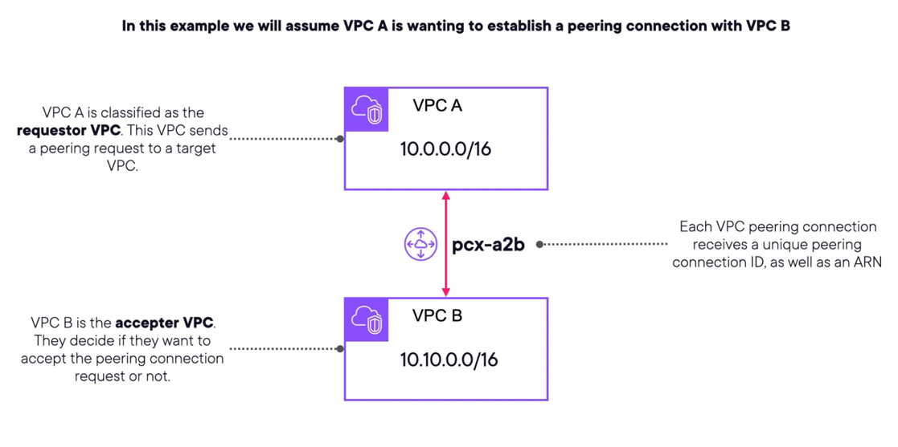

# AWS VPC Networking
- A logically isolated section of the AWS Cloud where you can launch AWS resources in a virtual network that you define.
- You have complete control over your virtual networking environment, including selection of your own IP address range, creation of subnets, and configuration of route tables and network gateways.
- VPC is the virtual version of a traditional network datacenter, with the benefits of using the scalable infrastructure of AWS.
- Two types of VPCs:
  - Default VPC: Automatically created in each region, with a default subnet in each availability zone.
  - Custom VPC: Created by the user, allowing for more control over the network configuration.

## VPC Components
- CIDR Block: A range of IP addresses in CIDR notation.
- Subnets: You can assign IP addresses, both IPv4 and IPv6, to your VPCs and subnets. You can also bring your public IPv4 addresses and IPv6 GUA addresses to AWS and allocate them to resources in your VPC, such as EC2 instances, NAT gateways, and Network Load Balancers.
- Routing: Use route tables to determine where network traffic from your subnet or gateway is directed.
- Gateways and endpoints: A gateway connects your VPC to another network. For example, use an internet gateway to connect your VPC to the internet. Use a VPC endpoint to connect to AWS services privately, without the use of an internet gateway or NAT device.
- Peering connections: Use a VPC peering connection to route traffic between the resources in two VPCs.
- Traffic Mirroring: Copy network traffic from network interfaces and send it to security and monitoring appliances for deep packet inspection.
- Transit gateways: Use a transit gateway, which acts as a central hub, to route traffic between your VPCs, VPN connections, and AWS Direct Connect connections.
- VPC Flow Logs: A flow log captures information about the IP traffic going to and from network interfaces in your VPC.
- VPN connections: Connect your VPCs to your on-premises networks using AWS Virtual Private Network (AWS VPN).
- NACLS: Network ACLs (NACLs) are stateless firewalls that control inbound and outbound traffic at the subnet level.
- Security Groups: Security groups are stateful firewalls that control inbound and outbound traffic at the instance level.

## VPC CIDR
- you can select an IP CIDR block for your VPC, which defines the range of IP addresses that can be used within the VPC.
- Private IPV4 blocks are required and range from /16 to /28.
- IPV6 CIDR blocks are optional and range from /44 to /60
- CIDR must be from the RFC 1918 range (Private IP Space): 10.0.0.0/8, 172.16.0.0/12, 192.168.0.0/16
  - These IPs are private and not publicly resolvable on the internet.
  - Carefully plan your CIDR block to avoid conflicts with other networks, especially if you plan to connect your VPC to on-premises networks or other VPCs.
  - Plan CIDR to be large enough to accommodate future growth, as CIDR blocks cannot be resized after creation.
- AWS VPCs are regional resources, meaning they are created within a specific AWS region and can span multiple availability zones within that region.
- Limits
  - 5 VPCs per region by default, which can be increased by requesting a limit increase.
  - 200 subnets per VPC by default, which can also be increased by requesting a limit increase.
  - 50 route tables per VPC by default, which can be increased by requesting a limit increase.
  - 5 internet gateways per region by default, which can be increased by requesting a limit increase.
  - 50 NAT gateways per region by default, which can be increased by requesting a limit increase.
  - 50 VPC endpoints per region by default, which can be increased by requesting a limit increase.
  - 50 VPC peering connections per VPC by default, which can be increased by requesting a limit increase.
  - 50 transit gateways per region by default, which can be increased by requesting a limit increase.

## Internet Gateway
- Supports IPv4 and IPv6 traffic.
- Automatically scales for traffic and offers high availability.
- Enables public subnet resources to connect to the internet.
- Give you a target in your VPC for internet-routable traffic to flow through.
- Created separately from the VPC and can be attached to only one VPC at a time.

## VPC Subnets
- A subnet is a range of IP addresses in your VPC for hosting resources.
- Subnets are bound to a single availability zone, which provides high availability and fault tolerance.
- Subnets support IPV4 Only, IPV6 Only, or Dual Stack (IPV4 and IPV6).
- Four Types of Subnets:
  - Public Subnet: Has a route to the internet through an internet gateway, allowing resources to communicate with the internet.
  - Private Subnet: Does not have a route to the internet, used for resources that do not require direct internet access.
  - Isolated Subnet: Similar to a private subnet but does not allow any inbound or outbound traffic from the internet.
  - VPN Only Subnet: Used for resources that need to connect to on-premises networks via a VPN connection.
- AWS reserves 5 IP addresses in each subnet CIDR block for internal use, so the first four IP addresses and the last IP address in the CIDR block are reserved.
  - Example: In a /28 subnet, you only have 11 usable IP addresses.
    - 16-5 = 11 usable IP addresses
    - The first IP address is reserved for network address
    - The second IP address is reserved for the VPC router
    - The third IP address is reserved for DNS
    - The fourth IP address is reserved for future use
    - The last IP address is reserved for broadcast
  - Example VPC CIDR Block: 10.0.0.0/16, Subnet CIDR Block: 10.0.0.0/24
    - 10.0.0.0 - Network address
    - 10.0.0.1 - VPC router
    - 10.0.0.2 - DNS
    - 10.0.0.3 - Future use
    - 10.0.0.255 - Broadcast address

## VPC Route Tables
- A route table contains a set of rules, called routes, that are used to determine where network traffic is directed.
- Each subnet in your VPC must be associated with a route table.
- If a subnet is not explicitly associated with a route table, it uses the main route table for the VPC.
- The main route table is created automatically when you create a VPC.
- You can create additional route tables to control traffic flow within your VPC.
- Route tables can have multiple routes, each with a destination CIDR block and a target (such as an internet gateway, NAT gateway, or VPC peering connection).
- Routes are evaluated in order, and the first matching route is used to direct traffic.
- Custom route table concepts
  - Destination: The destination CIDR block for the route.
  - Target: The target for the route, such as an internet gateway, NAT gateway, or VPC peering connection, etc. where destination traffic should go.
  - Local: A special route that allows communication between instances in the same VPC.
  - Association: The association between a subnet and a route table, which determines which route table is used for traffic from that subnet.
- Generally, it is the best practice to have 1:1 relationship between a subnet and a route table, meaning each subnet should be associated with only one route table.
- However, you can associate multiple subnets with the same route table if they share the same routing requirements.

## NACLs
- Essentially a stateless firewall to control traffic at the subnet level.
- Stateless: Must explicitly define both inbound and outbound traffic rules.
- Assign one NACL per subnet, with a default NACL in place if needed.
- Newly created NACLs will deny all traffic by default until you add rules.
- Rules are evaluated in order, starting from the lowest numbered rule.
- With NACLs you can not filter below resources traffic.
  - NACLs do not work with DNS, So you can not use nacls to filter dns resolutions.
  - NACLs do not work with DHCP
  - NACLs do not work with EC2 Instance Metadata Service (IMDS)
  - NACLs do not work on Reserved IPs addresses used by the default VPC router.
- Ephemeral Ports
  - Short-Lived transport protocol ports that operating system allocate for client-side transmissions when they connect to a server.
  - Ephemeral port ranges vary by operating system.
  - Example:
    - Inbound HTTP connections use port 80, but the outbound connection will be on a port between 1024-65535.

## Security Groups
- Controls the traffic that is allowed to reach and leave the resources that it associated with.
- Stateful: If you allow inbound traffic on a port, the response traffic is automatically allowed, regardless of outbound rules.
- Security groups are associated with network interfaces, which are attached to resources like EC2 instances.
- Security groups can be associated with multiple resources, and multiple security groups can be associated with a single resource.
- Security groups are evaluated based on the rules defined within them, and all rules must be satisfied for traffic to be allowed.
  - Example: If a security group allows inbound traffic on port 80 from a specific IP address, the response traffic on port 80 will be allowed regardless of outbound rules.
  - Security groups do not have a default deny rule, meaning if no rules are defined, all traffic is denied.
  - Security groups do not have a default allow rule, meaning if no rules are defined, all traffic is denied.
- Implicit Deny: If no rules match, the traffic is denied.
- Components
  - Protocol: The protocol for the rule, such as TCP, UDP, or ICMP.
  - Port Range: The port range for the rule, such as 80 for HTTP or 443 for HTTPS.
  - Source/Destination: The source or destination IP address or CIDR block for the rule.
  - Description: An optional description for the rule to help identify its purpose.
- You can reference other security groups in the source or destination field, allowing for more granular control over traffic.

## DHCP Option Sets
- A DHCP Option set is a group of network settings used by resources in your VPC
- These allow you to control the following aspects of the network configuration in your VPC:
  - DNS Servers: Specify the DNS servers that instances in your VPC should use for name resolution.
  - Domain Name: Specify the domain name that instances in your VPC should use for name resolution.
  - NTP Servers: Specify the Network Time Protocol (NTP) servers that instances in your VPC should use for time synchronization.
  - NetBIOS Name Servers: Specify the NetBIOS name servers that instances in your VPC should use for name resolution.
  - DNS ON or OFF: Enable or disable DNS resolution in your VPC.
- You can associate a DHCP Option set with multiple VPCs
- However, each VPC can have only one associated DHCP Option set at a time.
- Each AWS Region has a default DHCP Option set that is automatically created when you create a VPC.
- Each VPC uses the default DHCP Option set for its region unless you specify otherwise
- You can create and associate a custom DHCP option set with the VPC, or use no DHCP option set at all.
- You can not modify a DHCP Option set once it is created, but you can create a new one and associate it with the VPC.

## VPC Peering
- Feature to enable secure and direct communication between two VPCs.
- Traffic remains within the AWS network infrastructure.
- Enables private resources to communicate and interact.
- Features to ensures there is no single point of failure for a connection.
- Connect cross-account, same account, and even cross-region VPCs.

- Accepter vpc CIDR will be shown after the peering connection is established.
- You can enable a VPC to resolve public IPV4 DNS hostnames to private IPv4 addresses when queried from instances in the peer VPC
  - To accomplish this, both VPCs must have DNS hostnames and DNS resolution enabled

- VPC Peering must knows
  - Peered VPCs cannot have any overlapping CIDR blocks.
  - Peering does NOT allow for transitive routing
  - Route tables must be updated to correctly route the traffic destined for a peered VPC.

- Below image represents NOT transitive routing

- When VPCs are peered in the same region, you can reference peered VPC security group IDs as needed (e.g. security group rules).

- Use Cases
  - Centralized Shared Services VPC
  - Multi-Region Internal Applicaiton Deployment
  - Cross-Account VPC integration for collaboration or merger/acquisition scenarios.

## NAT Gateways
- NAT: Network Address Translation
- A service that operates on a router or edge platform to connect private networks to public networks like the internet.
- With NAT, an organization needs one IP address or one limited public IP address to represent and entire group of devices as they connect outside their network
- AWS NAT gateway is a Network Address Translation (NAT) service in AWS.
- You can use a NAT gateway so that instances in a private subnet can connect to services outside your VPC but external services cannot initiate a connection with those instances.
- Why NAT
  - Allows resoruces in private subnets to connect to the internet, peered VPCs an on-prem networks
  - Private resources cannot receive unsolicited connection requests from outside the network.
- NAT Gateway vs NAT Instance
  - NAT Gateway is a managed service that automatically scales and provides high availability.
  - NAT Instance is an EC2 instance that you must manage, scale, and maintain.
  - NAT Gateway supports both IPv4 and IPv6 traffic, while NAT Instance only supports IPv4 traffic.
  - NAT Gateway is more cost-effective for high traffic volumes, while NAT Instance is more cost-effective for low traffic volumes.
  - NAT Instance: outdated, should avoid. Provides network address translation via an EC2 instance that you own and manage! Lots of overhead.
  - NAT Instance: requires that you diable source/destination check
  - NAT Gateways: Automatically scale as needed (5 Gbps to 100 Gbps). Deployed to a single AZ. Leverage an Elastic IP address.
  - You will likely choose NAT Gateways over NAT Instances whenever you can.
  - For true resiliency, you must deploy a NAT Gateway in multiple AZs. In this scenario you need to keep an eye on the costs !
- You must deploy NAT devices within a public subnet to allow internet access !
- You do not assign security groups to NAT gateways, but you can assign network ACLs to control traffic.

## Elastic IP Address
  - A static IPv4 address designed for dynamic cloud computing. 
  - An elastic IP address is allocated to your AWS account, and is yours untill you realise it.
  - These are regional resources that do not change over time.

## Transit VPCs
- Peering VPCs are not transitive by default
- You can achieve a Transit VPC by using a VPN solution

- Virtual Private Gateway (VGW)
  - It is a simply the VPN concentrator on the AWS side of a sit-to-site VPN connection.
  - You attach a VGW to your VPC, and then create a VPN connection between the VGW and your on-premises network.
  - VGW is a managed service that provides high availability and scalability.

## VPC Endpoints & AWS Private Link
- AWS Private Link is a highly available, scalable technology that enables private connectivity between VPCs and AWS services as if they were in the same VPC.
- Aws service is going to leverage the public endpoint by default.
- Private Link allows your private resources to communicate with services entirely within the AWS private network.
- Allows you to remove need of IGWs, NAT Gateways, VPNs, Direct Connects
- Create endpoints within your VPC to control and secure the traffic
- Capable of hosting your own private services as well by setting up a service provider and a service consumer.

- AWS Private Link is what powers VPC Interface Endpoints, which will be discussed soon !

